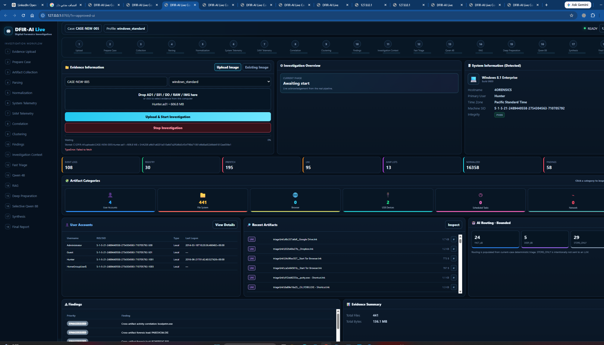

# DFIR-AI v2.0

**Local AI-Assisted Digital Forensics & Incident Response Investigation Platform**

DFIR-AI is a local, evidence-grounded DFIR investigation workflow designed to reduce large forensic datasets into a bounded, reviewable investigation set while preserving provenance and keeping original evidence read-only.

> **Important:** AI-assisted forensic investigation; analyst validation required. Original evidence remains read-only.

## V2 Highlights

- Live local web dashboard for case execution and investigation monitoring
- Evidence upload or existing-image selection
- Supported evidence containers: **AD1 / E01 / DD / RAW / IMG**
- Live pipeline progress and current-stage visibility
- Stop Investigation control for the active case process tree
- Early deterministic **System Telemetry** and **SAM Telemetry**
- Artifact inventory and on-demand artifact inspection
- Deterministic normalization, correlation, clustering, and finding generation
- Bounded AI routing:
  - `FAST_4B` → local Qwen 4B
  - `DEEP_8B` → selective local Qwen 8B
  - `STORE_ONLY` → no LLM
- Historical DFIR RAG used as investigation context only
- Deterministic case synthesis
- Final DFIR Report V2
- Sidebar workflow visualization with a 3-second sequential display delay

## Dashboard



The dashboard is a local web UI served from `127.0.0.1`. It does not replace forensic validation; it visualizes the real pipeline state, current-case evidence, deterministic telemetry, routing, findings, and report progress.

## Architecture

```text
Forensic Image / Container
        |
        v
Evidence Reader
        |
        v
Artifact Acquisition Profile
        |
        v
Artifact Collection
        |
        v
Parsing
        |
        v
Normalization
        |
        v
Evidence DB + Provenance
        |
        +--------------------+
        |                    |
        v                    v
System Telemetry         SAM Telemetry
        |                    |
        +---------+----------+
                  |
                  v
             Correlation
                  |
                  v
              Clustering
                  |
                  v
               Findings
                  |
                  v
        Investigation Context
                  |
                  v
           Deterministic Triage
            /        |        \
           /         |         \
      FAST_4B     DEEP_8B   STORE_ONLY
         |           |           |
      Qwen 4B   Deep Prep     No LLM
                     |
                  Qwen 8B
                     |
          +----------+----------+
          |                     |
          v                     v
       DFIR RAG          Current-Case Evidence
          \                     /
           \                   /
            v                 v
           Deterministic Synthesis
                    |
                    v
             Final DFIR Report V2
```

## Pipeline Stages

The V2 workflow is organized as:

1. Evidence Upload
2. Prepare Case
3. Artifact Collection
4. Parsing
5. Normalization
6. System Telemetry
7. SAM Telemetry
8. Correlation
9. Clustering
10. Findings
11. Investigation Context
12. Fast Triage
13. Qwen 4B
14. RAG
15. Deep Preparation
16. Selective Qwen 8B
17. Synthesis
18. Final Report

The dashboard visualization may intentionally delay the left-side completion animation by 3 seconds per displayed step. This is a **visualization effect only** and does not delay the forensic pipeline.

## Evidence Handling

DFIR-AI is designed around forensic safety:

- Original evidence is never intentionally modified.
- Current-case evidence is authoritative.
- Every normalized case fact should retain `event_uid` and provenance.
- Correlation does not equal causation.
- Detection title or severity alone does not establish maliciousness.
- Historical RAG similarity is contextual guidance, not current-case evidence.
- Duplicate representations of the same EVTX source are not treated as independent corroboration.
- Missing artifact families are valid capability states and should not automatically fail a case.

## Deterministic Telemetry

V2 adds early deterministic host intelligence, including supported fields such as:

- Hostname
- Operating system
- Build
- Time zone
- Machine SID
- Primary/local users
- Network information when available
- USB device information when available
- SAM-derived account metadata

These facts are produced deterministically from current-case evidence and are not delegated to the LLM.

## Correlation and Findings

The platform correlates normalized forensic events into bounded investigation structures. Findings remain evidence-grounded and should be reviewed by a DFIR analyst.

The system does **not** infer maliciousness from:

- an executable name alone,
- a detection title alone,
- high Prefetch run count alone,
- temporal proximity alone,
- historical similarity alone.

## Bounded Local AI

V2 uses selective local inference instead of asking one model to read the entire case.

```text
HIGH / deep candidates   -> Qwen 8B selective investigation
MEDIUM / fast candidates -> Qwen 4B fast analysis
STORE_ONLY               -> no LLM
```

Local Qwen inference is designed to run sequentially on CPU-constrained systems.

## Historical DFIR RAG

Historical investigation knowledge may be retrieved to provide:

- similar historical behavior,
- investigative directions,
- useful evidence to review,
- contextual investigative experience.

It must **never** be treated as proof that the same behavior occurred in the current case.

Historical report corpora and private corpus-building material should not be committed to the public repository.

## Final Report

V2 produces a deterministic DFIR report after case-level synthesis. Typical sections include:

- Executive Summary
- Evidence Coverage
- Priority Evidence Themes
- Evidence Timeline
- Key Findings
- Observed Facts
- Possible Related Activity
- Historical Context
- Evidence Gaps
- Recommended Next Steps
- Analytical Conclusion
- Evidence and Analytical Safeguards

## Quick Start

### Requirements

The current development environment is Windows-focused and uses local tooling.

Typical requirements include:

- Windows 10/11
- Python environment for the DFIR-AI MCP modules
- Docker for local supporting services where used
- Ollama
- Qwen local models used by the configured workflow
- Qdrant for historical DFIR RAG
- Required forensic parsers/tools configured for the selected acquisition profile

Tool licenses and redistribution terms must be reviewed separately. Do not commit third-party forensic binaries unless their licenses explicitly allow redistribution.

### Run a Full Case

From the MCP environment:

```powershell
python .\run_full_case_v1.py `
  --case CASE-DEMO-001 `
  --image "D:\Evidence\example.E01"
```

Optional profile:

```powershell
python .\run_full_case_v1.py `
  --case CASE-DEMO-001 `
  --image "D:\Evidence\example.E01" `
  --profile windows_standard
```

### Resume an Existing Case

If collection/parsing/import already completed, use the case orchestrator rather than starting the full acquisition path again:

```powershell
python .\run_case_v2.py --case CASE-DEMO-001
```

### Start the Dashboard

```powershell
python .\dashboard\web\dashboard_server.py
```

Then open:

```text
http://127.0.0.1:8765/
```

## Repository Safety

The public repository must not contain:

- forensic evidence images,
- real case workspaces,
- generated case databases,
- real telemetry exports,
- generated DFIR reports containing case data,
- API keys or tokens,
- `.env` files,
- private keys,
- local AI model files,
- Qdrant databases,
- historical report corpora,
- local development backups,
- user-profile paths or organization-specific internal data.

Run the V2 release audit before every public push.

## Release

Current release target: **v2.0.0**

See [CHANGELOG.md](CHANGELOG.md) for release details.

---

### Analyst Validation Disclaimer

**AI-assisted forensic investigation; analyst validation required. Original evidence remains read-only.**

DFIR-AI is intended to assist qualified DFIR practitioners. AI output, automated correlations, findings, timelines, and recommendations must be validated against the referenced current-case evidence before being treated as final.

---

Built for DFIR investigation workflows.

**Alaa Sikingo**
